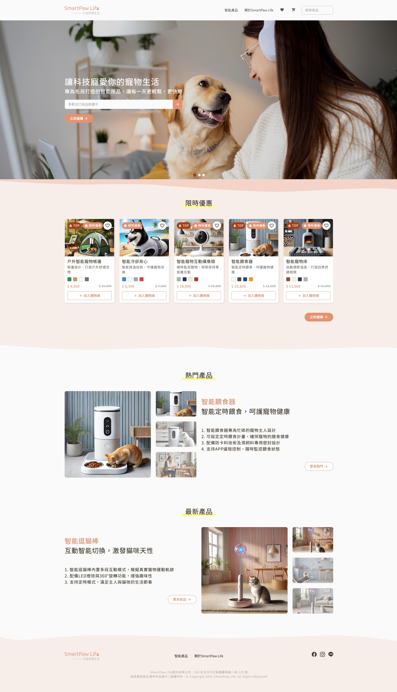
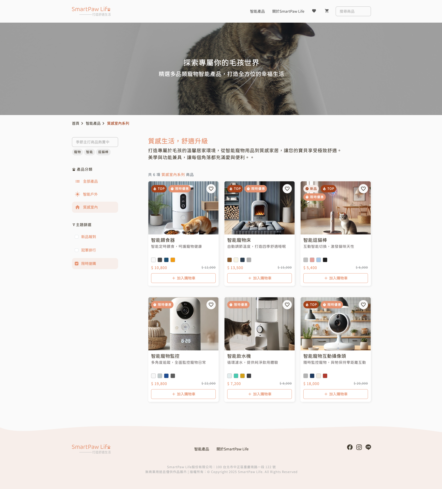
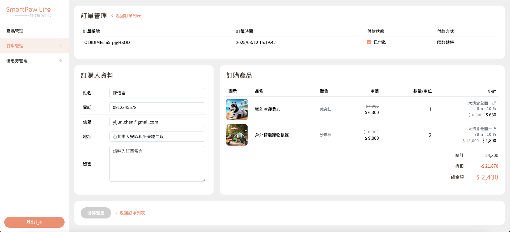

# 🐾 SmartPawLife｜寵物智慧電商平台

> 📘 This README is in Chinese. [Click here for English version.](./README_EN.md)

SmartPawLife 是一個專為寵物打造的智慧電商平台，包含前台購物流程與後台管理系統。
支援商品瀏覽、購物車、結帳流程與後台商品管理、訂單管理、優惠券管理功能，並於前台和後台登入頁實作響應式設計。

👉 本專案旨在將原先以 JavaScript 撰寫的 SmartPawLife，重構為 TypeScript 版本，以提升型別安全與可維護性。

👉 [🔗 前台線上Demo](https://satarkuo.github.io/SmartPawLife-ts/)

👉 [🔗 後台線上Demo](https://satarkuo.github.io/SmartPawLife-ts/#/login) (後台建議使用裝置解析度寬1440px以上)

✨ 歡迎自由操作前台下單、後台登入管理資料，只要不動到原有資料即可！

---

## 🔐 測試帳號

後台登入可使用以下帳號：

```txt
測試帳號：satarkuo@gmail.com
測試密碼：123456
```

---

## 🙋‍♀️ 開發與參與人員

- 前端：本人，負責前端開發，包含前台後台切版、API串接、功能資料渲染

- 設計：Ｍillie Qiu 設計師

- 後端：提供現成 API 與 pathURL 申請串接

---

## ✨ 功能介紹

### 🔸 功能簡介

- 使用 React + Redux Toolkit 建構前台購物流程與後台管理系統
- 串接 RESTful API，支援商品、訂單、優惠券 操作
- 使用 Sass 7-1 Pattern 管理樣式、整合 Bootstrap5、Material Icons
- 完成購物車功能、商品篩選搜尋、RWD 響應式設計
- 前後台登入系統，登入憑證以 Cookie 管理
- 使用 Vite 開發、Prettier、ESLint 統一團隊程式碼風格

### 🔸 前台功能

- 首頁
- 商品列表、商品詳細頁
- 商品分類篩選 (Redux/ RTK:Redux Toolkit)
  - 主分類：全部、智能戶外系列、質感室內系列
  - 主題篩選：新品報到(最新上架)、冠軍排行(熱門商品)、限時搶購(折扣商品)
- 商品關鍵字搜尋 (含快速帶入關鍵字功能)
- 加入購物車、修改數量、刪除商品
- 購物車填寫表單結帳流程 (react-hook-form)
- 品牌介紹頁
- 加入、取消收藏商品(使用localStorage)
- 使用者登入(使用cookie儲存token)
- 響應式設計（RWD）

### 🔸 後台功能（Admin）

- 管理者登入
- 商品管理：新增、編輯、刪除、查看單一商品
- 訂單管理：查看單一訂單、編輯、刪除
- 優惠券管理：新增、編輯、刪除、查看單一優惠券

---

## 🛠 技術架構與使用套件

- **框架**：React + Vite
- **樣式**：Bootstrap5、Material Icons、SCSS、Sass 7-1 Pattern
- **套件**：SweetAlert2、react-loading
- **路由管理**：React Router
- **狀態管理**：useState + useEffect + Redux Toolkit
- **表單管理**：react-hook-form
- **API 串接**：Axios（串接課程提供 API）
- **畫面邏輯**：前後台功能與頁面功能皆由本人自行實作（含資料渲染、錯誤處理等）

---

## 📁 專案資料夾結構簡介

- 本專案採用模組化設計，資料夾說明如下：

```txt
src/
├─ assets/      # 靜態資源（圖檔、Sass 7-1 Pattern管理樣式等）
├─ component/   # 可重複使用的元件
├─ data/        # 靜態資料
├─ hooks/       # 自定義 React Hooks
├─ layout/      # 主要頁面架構（Header、Footer 等）
├─ redux/       # Redux Toolkit 狀態管理設定
├─ routes/      # React Router 路由設定
├─ utils/       # 工具函式（轉換時間格式等）
└─ views/       # 頁面元件（所有前後台頁面）
```

---

## 🚀 快速啟動

```bash
# 安裝套件
npm install

# 啟動專案
npm run dev
```

---

## 📷 畫面預覽

以下為 SmartPawLife 專案部分畫面截圖，完整體驗請參考 Demo 網站。

### 首頁畫面



### 產品列表畫面



### 後台訂單管理畫面


