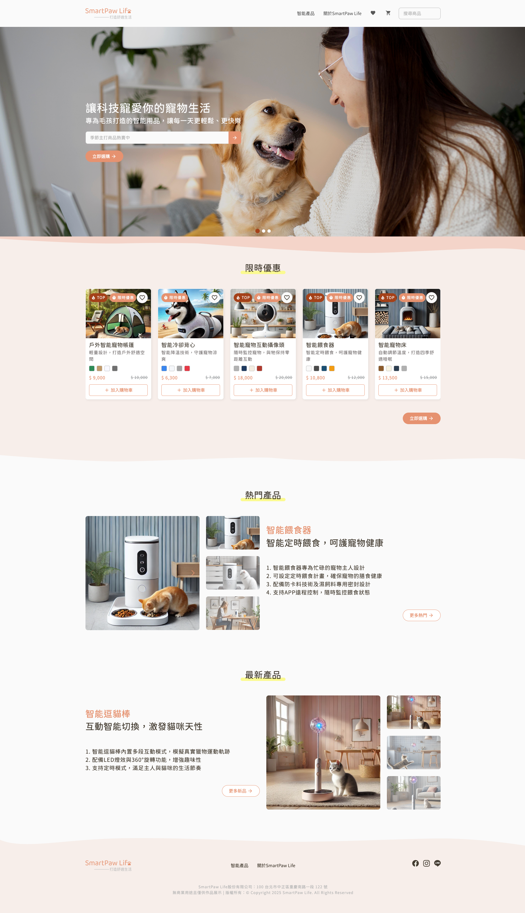
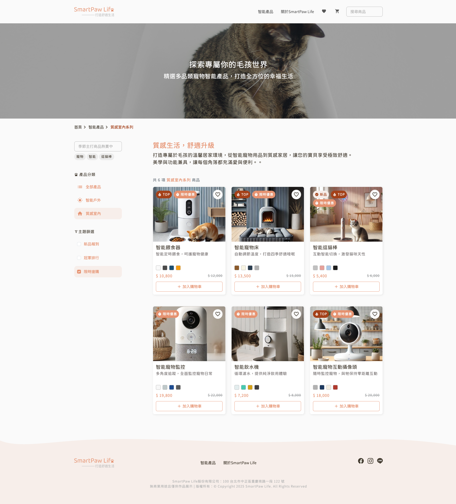
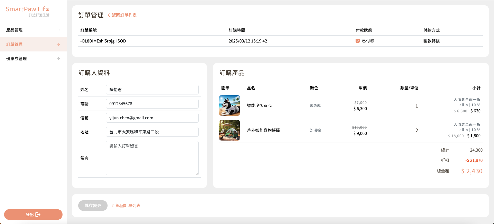

# 🐾 SmartPawLife｜Smart Pet E-commerce Platform

SmartPawLife is a smart e-commerce platform designed for pet lovers.  
It provides a complete front-end shopping experience along with a full-featured admin management system.  
Key features include product browsing, shopping cart, checkout process, coupon management, and responsive design on both user and admin login pages.

👉 [🔗 Frontend Demo](https://satarkuo.github.io/SmartPawLife/)  
👉 [🔗 Admin Demo](https://satarkuo.github.io/SmartPawLife/#/login) (Best viewed at 1440px+ screen width)

---

## 🔐 Test Account

You can use the same account for admin login:

```txt
Email: satarkuo@gmail.com
Password: 123456
```

---

## ✨ Features

### 🔸 Frontend

- Home page
- Product listing and detail pages
- Product filtering (using Redux Toolkit)
  - Main categories: All, Outdoor Series, Indoor Series
  - Themes: New Arrivals, Top Ranking, Limited Deals
- Keyword search (with quick keyword buttons)
- Add/edit/remove items in cart
- Multi-step checkout form (using react-hook-form)
- Brand introduction page
- Favorite/unfavorite products (using localStorage)
- User login (token stored via cookie)
- Responsive Web Design (RWD)

### 🔸 Admin (Backend)

- Admin login
- Product management: Create, edit, delete, view single product
- Order management: View, edit, delete orders
- Coupon management: Create, edit, delete, view single coupon

---

## 🛠 Tech Stack & Tools

- **Framework**: React + Vite
- **Styling**: Bootstrap 5, SCSS, Material Icons、Sass 7-1 Pattern
- **Packages used**: SweetAlert2 (alert dialogs), react-loading (loading animations)
- **Routing**: React Router
- **State Management**: useState, useEffect, Redux Toolkit
- **Form Handling**: react-hook-form
- **API Integration**: Axios (data provided by HexSchool training API)
- **Development**: Frontend logic, API integration, and all UI were independently implemented

### 📦 Dependencies

```txt
@reduxjs/toolkit: ^2.6.0
axios: ^1.7.9
bootstrap: ^5.3.3
material-icons: ^1.13.14
react: ^18.3.1
react-dom: ^18.3.1
react-hook-form: ^7.54.2
react-loading: ^2.0.3
react-redux: ^9.2.0
react-router-dom: ^6.29.0
sweetalert2: ^11.17.2
swiper: ^11.2.5
```

### 🧰 Dev Dependencies

```txt
@eslint/js: ^9.19.0
@types/react: ^19.0.8
@types/react-dom: ^19.0.3
@vitejs/plugin-react: ^4.3.4
eslint: ^9.19.0
eslint-plugin-react: ^7.37.4
eslint-plugin-react-hooks: ^5.0.0
eslint-plugin-react-refresh: ^0.4.18
globals: ^15.14.0
sass: ^1.62.1
vite: ^6.1.0
```

---

## 📁 Project Structure

- This project adopts a modular folder structure for better scalability and maintainability. Folder descriptions are as follows:

```txt
src/
├─ assets/     # Static assets (images, styles, etc.)
├─ component/  # Reusable components
├─ data/       # Static data
├─ hooks/      # Custom React Hooks
├─ layout/     # Layout components (e.g., Header, Footer)
├─ redux/      # Redux Toolkit state management
├─ routes/     # Route configuration (React Router)
├─ utils/      # Utility functions (e.g., date formatting)
└─ views/      # Page-level components (all frontend and admin pages)
```

---

## 🚀 Getting Started

```bash
# Install dependencies
npm install

# Start the project
npm run dev
```

🔸 Note: This is a frontend-only project using APIs provided by the course. No backend server setup is required.

---

## ✨ Development Plan & Expansion

- Implement member registration & permissions using json-server-auth

- Add a blog section with article list and detail pages

- Use json-server + \_expand for handling article-author-reviews relationships

---

## 📷 Screenshots

Here are some snapshots from the SmartPawLife project. For a full experience, please visit the live demo.

### Home Page



### Product List



### Admin - Order Management

Note: All order and contact data shown are mock data.



---

## 🙋‍♀️ Contributors

- Frontend Developer: Satar Kuo

- UI Designer: Millie Qiu

- API Source: HexSchool React Project Course

## 📚 Mentors (HexSchool)

- React Instructor: Caspar

- JavaScript Instructors: Principal Wei-Chieh, Teacher Ying-Min

- Project Coach: Yennefer

- Project Mentor: Coach Yennefer

- Course Teaching Assistants: TA Jay, TA Jerry

## 🛠️ Project Revision Log

- Project Reviewer (TA): TA Jerry

- Project Design Reviewer: Designer Jamie

- Revisions were made based on the guidance provided by the teaching assistants and designer, with the process documented accordingly.

- [🔗 2025/03/31 - Revision Requests](https://wax-gladiolus-68e.notion.site/20250331-1c71186c0f56801982dde281079f4424?pvs=4)

- [🔗 2025/04/08 - Revision Requests](https://wax-gladiolus-68e.notion.site/20250408-1d01186c0f568027a76de0eb7d64cf55?pvs=4)

---

## 🏅 Certificates

### ✨ React Completion Certificate (HexSchool)

- All assignments completed at Level 3 (highest level)

- Official certificate expected to be issued on May 12, 2025

### ✨ React Skill Test - Level A (HexSchool)

- Includes multiple choice and live coding


### ✨ JavaScript Completion Certificate (HexSchool)

- All assignments completed at Level 3 (highest level)


